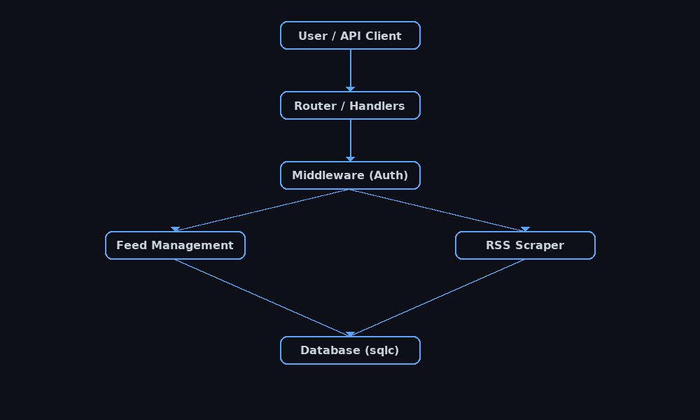

# 📡 RSS Aggregator

> A modular RSS feed aggregator and API server built with Go — fetch, parse, and serve RSS feeds through a RESTful API.

<p align="center">
  
</p>

---

## ✨ Features

- Fetch and aggregate feed content from multiple RSS sources.
- RESTful API for managing feeds and users.
- Modular code with dedicated handlers for feeds, users, and readiness checks.
- Middleware for authentication and request validation.
- Structured database access via `sqlc`.

---

## 📂 Project Structure

```

RSS\_Aggregator/
├── main.go                     # Entry point
├── rss.go                      # RSS parsing logic
├── scraper.go                  # Fetches & processes feed data
├── handler\_feed.go             # Feed API endpoints
├── handler\_feed\_follows.go     # Follow/unfollow feeds
├── handler\_user.go             # User API endpoints
├── handler\_readiness.go        # Health/readiness checks
├── handler\_err.go              # Error handling
├── middleware\_auth.go          # Authentication middleware
├── models.go                   # Data models
├── json.go                     # JSON encoding helpers
├── sqlc.yaml                   # SQLC configuration
├── go.mod / go.sum             # Go dependencies
├── .gitignore
└── docs/
└── architecture\_diagram.png

````

---

## 🚀 Getting Started

### Prerequisites
- **Go 1.21+**
- (Optional) **sqlc** for type-safe database bindings
- A PostgreSQL or SQLite database (if persistence is enabled)

### Installation

```bash
git clone https://github.com/Abhayooo7/RSS_Aggregator.git
cd RSS_Aggregator
go mod download
````

If using `sqlc`:

```bash
sqlc generate
```

---

## ▶️ Running the Application

```bash
go run main.go
```

Default server URL:

```
http://localhost:8080
```

---

## 📡 API Endpoints

| Endpoint              | Method | Description                |
| --------------------- | ------ | -------------------------- |
| `/healthz`            | GET    | Readiness check            |
| `/feeds`              | GET    | List all RSS feeds         |
| `/feeds`              | POST   | Add a new RSS feed         |
| `/feeds/{id}/refresh` | POST   | Force refresh a feed       |
| `/users`              | GET    | List users (auth required) |
| `/users`              | POST   | Create a new user          |

---

## 🛠️ Tech Stack

* **Language**: Go
* **Database Access**: `sqlc`
* **Architecture**: REST API with modular handlers
* **Auth**: Middleware-based authentication
* **Feed Parsing**: Native Go RSS parsing

---

## 🗺️ Architecture Overview

The architecture follows a clean separation of concerns:

1. **User / API Client** sends requests.
2. **Router / Handlers** dispatch requests to appropriate services.
3. **Middleware** enforces authentication.
4. **Feed Management** handles adding/listing feeds.
5. **Scraper** fetches & parses feeds.
6. **Database Layer** (via `sqlc`) stores and retrieves data.

<p align="center">
  
</p>

---

## 📬 Contact

<p align="center">
  <a href="mailto:abhaymahajan0007@icloud.com">
    
  </a>
  &nbsp;&nbsp;
  <a href="https://www.linkedin.com/in/abhay-mahajan-2a67021b5">
    
  </a>
  &nbsp;&nbsp;
  <a href="https://github.com/Abhayooo7">
    
  </a>
</p>

